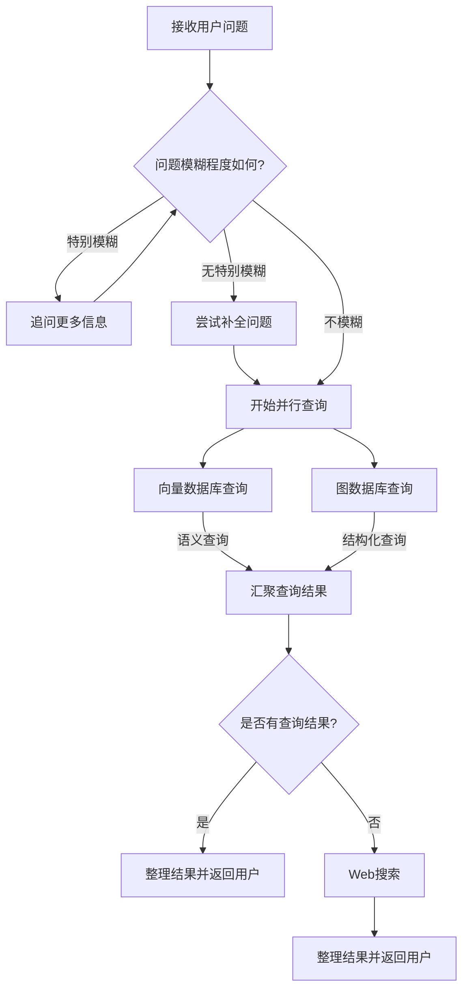

# 技术栈
- 应用框架: langchain，langgraph
- 数据存储: neo4j, faiss (因为chroma我windows装不了)
- 大模型: 智谱ai glm-4 (huggingface版本已经实现，我的小电脑跑不动:( )
- 嵌入模型: 智谱ai embedding-3 (同样，huggingface已经实现)
- RAG, GraphRAG, ReAct

# 环境配置
1. 安装依赖
    ```commandline
    pip install --upgrade --quiet langchain langchain_community jq json-repair networkx langchain-core langchain-experimental langchain-mistralai langchain-neo4j langchain-chroma
    pip install --upgrade --quiet  langchain-huggingface text-generation google-search-results numexpr langchainhub sentencepiece jinja2 bitsandbytes accelerate 
    pip install --upgrade --quiet tqdm transformers unstructured neo4j chromadb faiss-cpu langgraph retry
    ```

2. 安装neo4j

    使用docker安装
    ```commandline
    docker run -p 7474:7474 -p 7687:7687 -v $PWD/data:/data -v $PWD/plugins:/plugins --name neo4j-apoc -e NEO4J_apoc_export_file_enabled=true -e NEO4J_apoc_import_file_enabled=true -e NEO4J_apoc_import_file_use__neo4j__config=true -e NEO4JLABS_PLUGINS=\[\"apoc\"\] neo4j:latest
    ```

# 工作流


# TODO
- [ ] 优化Cypher生成prompt
- [ ] 优化知识图谱：实体去重
