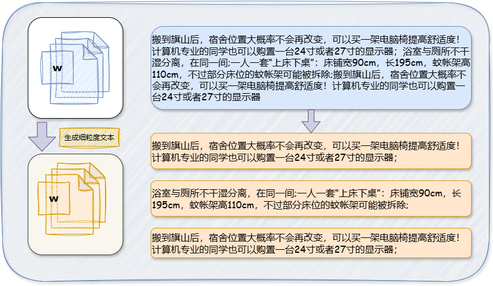
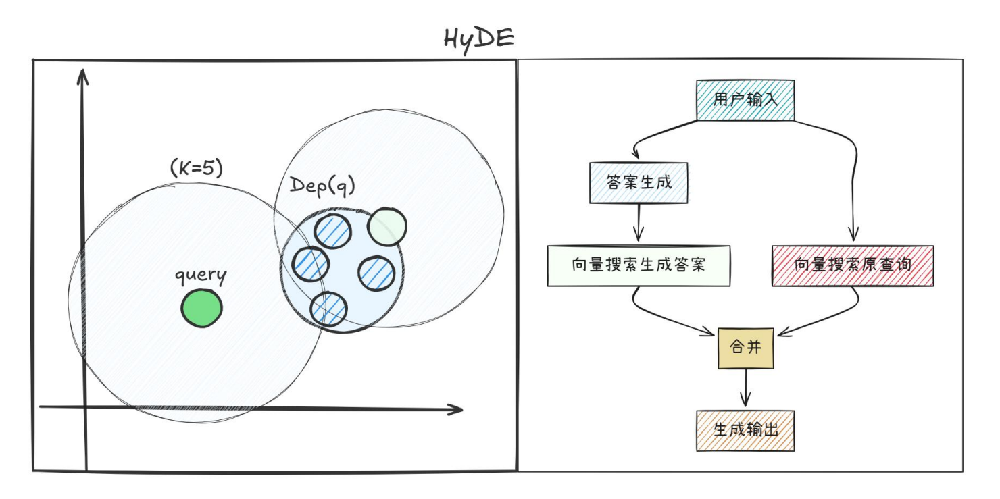

# Overview
FZU-AI-ANSWER is an intelligent assistant application based on RAG technology, designed to provide notification aggregation, daily life assistance, and Q&A dialogue functionalities.

<div align="center">
  <a href="#overview">English</a> | <a href="README.zh.md">中文</a>
</div>

# Running the Application
```bash
python -m venv venv
source venv/bin/activate
pip install -r requirements.txt

source entrypoint.sh
streamlit run web_page_reasoning.py
```

# RAG

## Data Chunking


## Document Domain Alignment


## Performance Evaluation
- Method: [RAGAS](https://docs.ragas.io/)
- Dataset: [MultiHop-RAG](https://huggingface.co/datasets/yixuantt/MultiHopRAG)


## Tools

- Application Frameworks: langchain, langgraph
- Vector Storage: faiss
- Knowledge Graph Storage: neo4j
- LLM: [Qwen/QwQ-32B](https://huggingface.co/Qwen/QwQ-32B)
- Embedding Model: [Alibaba-NLP/gte-Qwen2-1.5B-instruct](https://huggingface.co/Alibaba-NLP/gte-Qwen2-1.5B-instruct)

