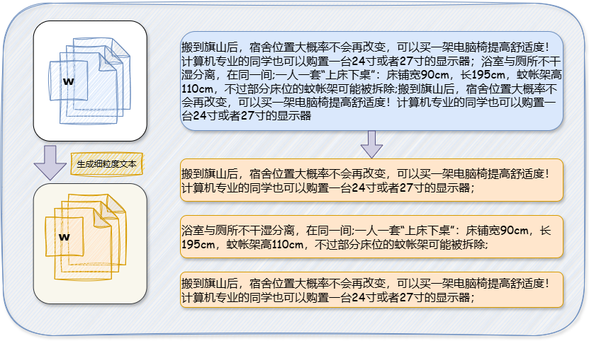
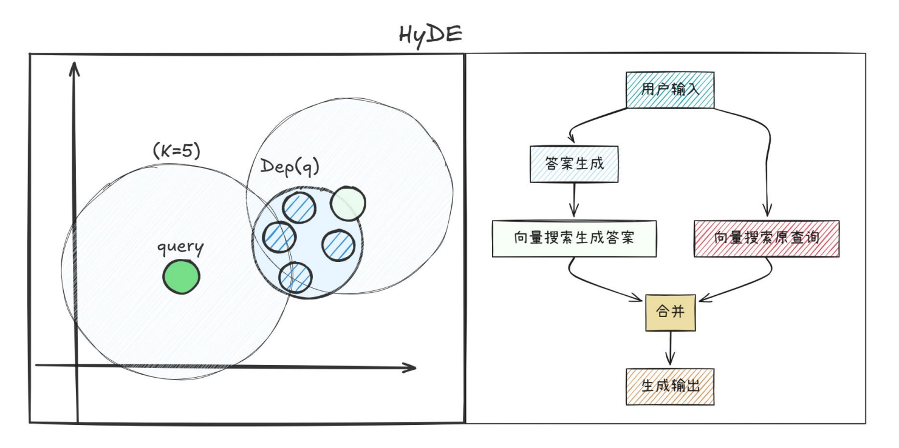

# 概述
FZU-AI-ANSWER 是一个基于RAG技术开发的智能助手应用，旨在提供通知汇总、日常生活助理、问答对话等功能。

<div align="center">
  <a href="#overview">English</a> | <a href="README.zh.md">中文</a>
</div>

# 运行
```bash
python -m venv venv
source venv/bin/activate
pip install -r requirements.txt

source entrypoint.sh
streamlit run web_page_reasoning.py
```

# RAG

## 数据切分


## 文档域对齐


## 性能评估
- 方法：[RAGAS](https://docs.ragas.io/)
- 数据集：[MultiHop-RAG](https://huggingface.co/datasets/yixuantt/MultiHopRAG)


## 工具

- 应用框架: langchain，langgraph
- 向量存储: faiss
- 知识图谱存储: neo4j
- LLM: [Qwen/QwQ-32B](https://huggingface.co/Qwen/QwQ-32B)
- 嵌入模型: [Alibaba-NLP/gte-Qwen2-1.5B-instruct](https://huggingface.co/Alibaba-NLP/gte-Qwen2-1.5B-instruct)